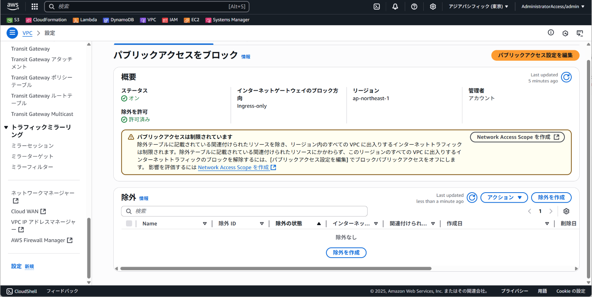
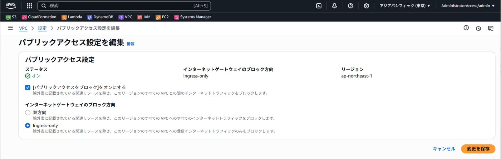
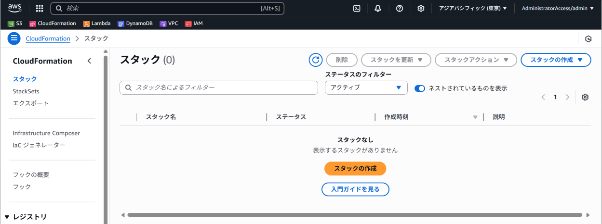
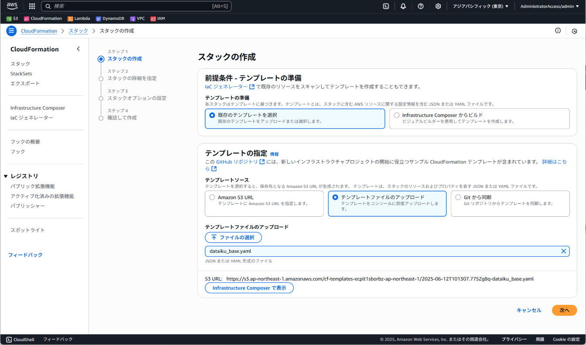
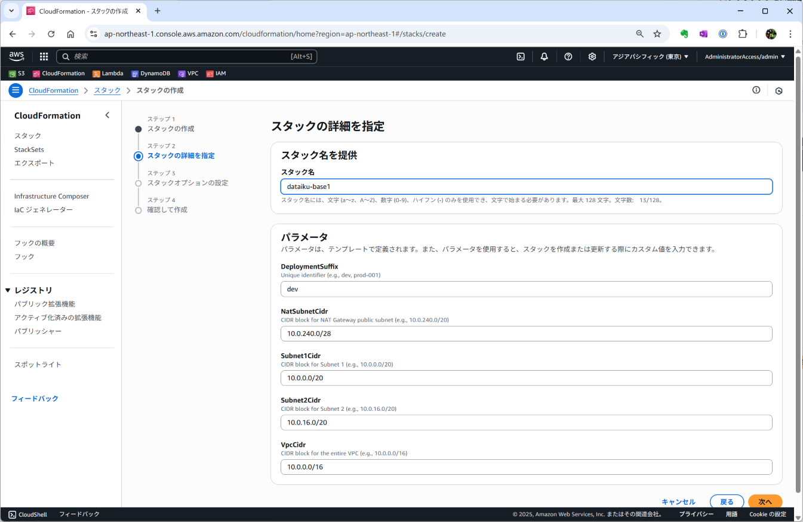
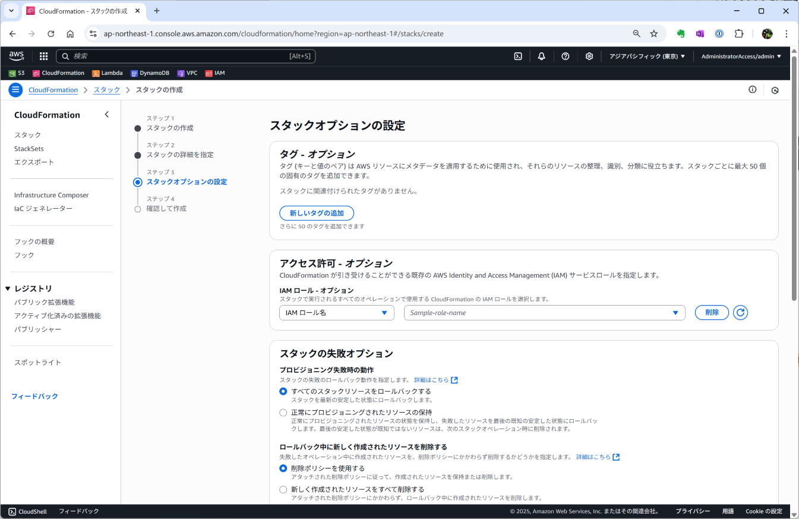
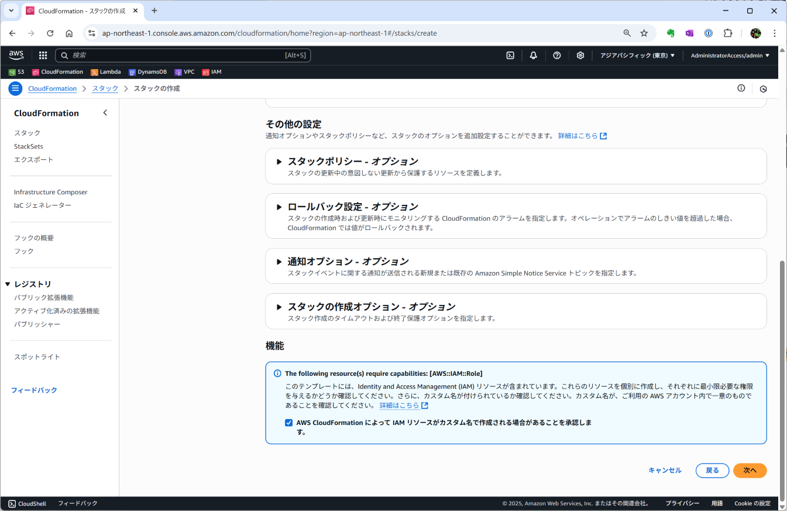
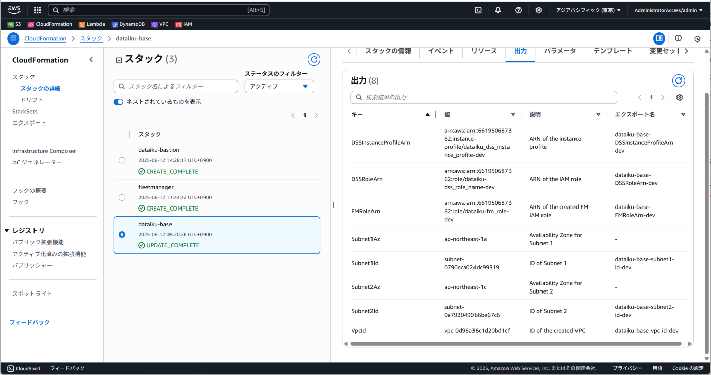
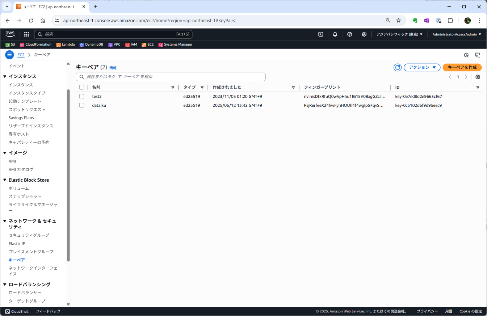
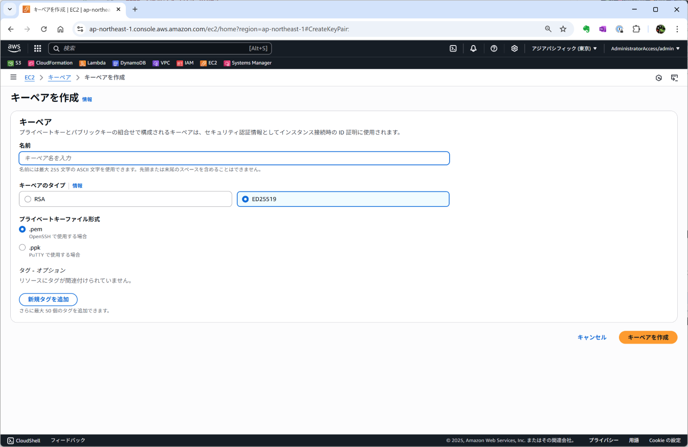

# dataiku cloudstack AWSデプロイ関係手順整理

[Dataiku Cloud Stacks for AWS](https://doc.dataiku.com/dss/latest/installation/cloudstacks-aws/index.html)の手順に従って、Dataikuを構築した際の手順メモをまとめます。

## 前提

セキュリティの厳しい環境での使用を考慮し、DataikuのVPCに対して、外部からのアクセスを一切遮断した状態で構築します。

- 基本的には、[Dataiku Cloud Stacks for AWS](https://doc.dataiku.com/dss/latest/installation/cloudstacks-aws/index.html)に従って構築。
- 手動での手順も、なるべくCloud Formationで構築。
- VPCは「パブリックアクセスをブロック」を有効にし、内向きアクセスのみブロックする。
- Windows Serverを立てて、踏み台とし、Fleet ManagerやDSSへのアクセスはWindows Server経由とする。

## 注意事項

- Fleet Manager、DSSをはじめ、すべてのDataikuのサービスには踏み台VMから接続する構成
- スピーディーに検証するための簡易的な構成であり、フローログの取得などはしていないため、そのまま本番環境に適用できるものではない。
- パブリックアクセスをブロックするため、Fleet Manager、DSS、Kubernetes等どのサービスを使用しても、インターネットからの接続は許可されず、インターネットとの接続に関する設定変更にはならない。
- 微妙に公式の手順と違うため、うまく動かない部分がある可能性もある。
- タグに関して全体的に言及していないので、必要に応じて追加すること。

## VPCの構築

### VPCの「パブリックアクセスをブロック」有効化

[Amazon Virtual Private Cloud
ユーザーガイド VPC とサブネットへのパブリックアクセスをブロックする](https://docs.aws.amazon.com/ja_jp/vpc/latest/userguide/security-vpc-bpa.html)に従って、内向きのアクセスをすべてブロックする設定を実施します。
リージョン単位での設定のため、他の用途で使用している場合破棄をつけて設定してください。

#### VPC設定画面
1. VPCの設定画面を開く(図は設定済みの画面だが、未設定の場合は、ステータスがオフになっている)
2. 「パブリックアクセス設定を編集」をクリック



#### VPCの設定画面を開く(図は設定済みの画面だが、未設定の場合は、ステータスがオフになっている)
1. 「[パブリックアクセスをブロック]をオンにする」にチェック
2. インターネットゲートウェイのブロック方法は「Ingress-only」を選択。
3. 「変更を保存」をクリック



### Fleet Manager構築に必要なVPC、サブネット、IAMロールの作成

Fleet ManagerのCloud Formationテンプレートのデプロイの準備として、VPC、サブネット、IAMロールの作成を実施する。

今回は、`cfn\dataiku_base.yaml`で、作成する。
必要かどうか不明だが、本来の手順と違い、NATGateway経由でのインターネットアクセスとする構成としている。
パブリックIPアドレスを割り当てないインスタンスでもインターネットアクセスが可能となる。

各サブネット1,2でもパブリックIPアドレスを振る設定は変えておらず、将来的にインターネットからのアクセスを許可する場合は、各インスタンスのパブリックIPアドレスをVPCパブリックアクセスをブロックの除外ルールに追加する想定。

#### スタックの作成

1. CloudFormationのページを開き、「スタックの作成」をクリック
2. 「新しいリソースを使用（標準）」をクリック



#### テンプレートの指定

1. 「既存のテンプレートを選択」を選択
2. テンプレートファイルのアップロードを選択
3. `cfn\dataiku_base.yaml`を指定する。
4. 「次へ」をクリック



#### テンプレートの指定

1. スタック名に任意の名称を指定。例：dataiku-base。dataiku-base-hoge
2. パラメータ
   1. DeploymentSuffixに3,4文字程度でアカウント内で一位となる文字列を指定。例：dev
   2. その他のパラメタは、特に希望がなければデフォルト値でよい。
4. 「次へ」をクリック



#### スタックオプションの設定

1. 「AWS CloudFormation によって IAM リソースがカスタム名で作成される場合があることを承認します。」にチェックをつける。
2. 「次へ」をクリック




#### 確認して作成

1. ここまでの設定内容が正しく入力されていることを確認。
2. 「送信」をクリック
3. スタックの作成が開始される。作成したスタックのステータスが「CREATE_COMPLETE」となれば完了。
4. 作成したスタックの出力タブにある各キーと値をメモしておく。




## Fleet Managerの作成

### キーペアの作成

Fleet ManagerやDSSなどのインスタンスに設定するキーペアを作成する。

#### キーペアの作成

1. EC2のキーペア画面に遷移する。
2. 「キーペアを作成」をクリック
3. 名前、キーペアのタイプ、プライベートキーファイル形式を指定し「キーペアを作成」をクリック
   1. 名前：任意の名称
   2. キーペアのタイプ：任意だが、「ED25519」でOK
   3. .pemとする
4. pemファイルをダウンロードして保存する。




### Fleet Managerの作成

[Fleet Manager setup](https://doc.dataiku.com/dss/latest/installation/cloudstacks-aws/guided-setup-new-vpc-elastic-compute.html#fleet-manager-setup)の手順に従って、Fleet Managerを構築する。

下記に手順を記載するが、VUPなどで変更されている可能性がある。参考程度としてください。

1. CloudFormationのページを開き、「スタックの作成」をクリック
2. 「新しいリソースを使用（標準）」をクリック
3. 手順に記載のある通り、URLを指定する。お試しに構築するだけでバックアップ不要であれば、no-dlmのほうを指定でよい。
4. パラメータを入力
   - Basic Settings
     - VPC ID：`cfn\dataiku_base.yaml`で作成したスタックの出力VpcIdの値
     - VPC CIDR：`cfn\dataiku_base.yaml`で作成したスタックで指定したCIDR（デフォルトであれば`10.0.0.0/16`）
     - Subnet ID：`cfn\dataiku_base.yaml`で作成したスタックの出力Subnet1Idの値
     - IP addresses allowed to connect to Fleet Manager：`0.0.0.0/0` (パブリックアクセスをブロックしているため全開放で問題なし)
     - SSH KeyPair：作成したキーペアの名称を選択する。
     - Fleet Manager IAM Role：`cfn\dataiku_base.yaml`で作成したスタックの出力FNRoleARNの末尾の名称部分
     - Username：`admin`(デフォルト値)
     - Password：Fleet Managerログイン用のパスワード
     - The SSL mode：`SELF_SIGNED`(デフォルト値)
     - The SSL public key：不要
     - The SSL secret name：不要
   - Advanced settings
     - Instance type：`t3.medium`(デフォルト値)
     - Public IP address：`False`
     - (Optional) Private IP address：不要
     - (Optional) Restore from this Snapshot ID：不要（Fleet Manager VUP時に指定）
     - (Optional) Volume encryption Key ID：不要

5. 「次へ」をクリック
6. 「AWS CloudFormation によって IAM リソースがカスタム名で作成される場合があることを承認します。」にチェックをつける。
7. 「次へ」をクリック
8. ここまでの設定内容が正しく入力されていることを確認。
9. 「送信」をクリック
10. スタックの作成が開始される。作成したスタックのステータスが「CREATE_COMPLETE」となれば完了。
11. EC2の画面に遷移し、作成したFleet ManagerのVMのプライベートIPv4アドレスをコピーして、保存しておく。

## 踏み台サーバへの接続

### 踏み台サーバの作成

`cfn\bastion.yaml`をCloudFormationで指定し、スタックを作成する。手順省略。

`DeploymentSuffix`には、`cfn\dataiku_base.yaml`のスタックと同じ値を指定すること。


### 踏み台サーバへの接続準備

クライアントPCに、AWS CLIおよび、Session Manager pluginをインストールする。

参考URL:[Install the Session Manager plugin for the AWS CLI](https://docs.aws.amazon.com/systems-manager/latest/userguide/session-manager-working-with-install-plugin.html)

#### 手順概要

AWS CLIのダウンロード、設定手順は省略。

1. `https://s3.amazonaws.com/session-manager-downloads/plugin/latest/windows/SessionManagerPluginSetup.exe`からダウンロード
2. `SessionManagerPluginSetup.exe`を実行
3. コマンドプロンプトで、`session-manager-plugin`を実行

### 踏み台サーバへの接続

targetを接続先インスタンスIDに書き換えて、下記を実行してください。

```sh
aws ssm start-session --region ap-northeast-1 --target i-xxxx --document-name AWS-StartPortForwardingSession --parameters "portNumber=3389, localPortNumber=13389"
```

リモートデスクトップを開き、`localhost:13389`へ接続。

## DSS作成

リモートデスクトップで接続した踏み台VMから、Webブラウザで、下記URLにアクセスする。
`https://10.0.0.x/`(Fleet Manager VMのプライベートIPアドレス)

[Start your first DSS](https://doc.dataiku.com/dss/latest/installation/cloudstacks-aws/guided-setup-new-vpc-elastic-compute.html#start-your-first-dss)の手順に従ってDSSを作成。

作成したDSSへの接続も、踏み台VMのWebブラウザからで、プライベートIPアドレスを指定して接続する。
